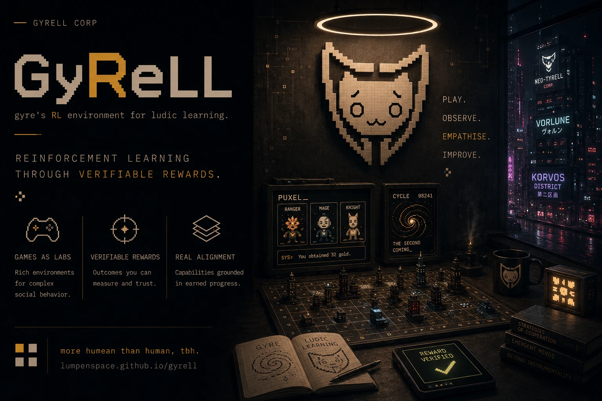

# GyReLL

**gyre's RL environment for ludic learning.**

GyReLL turns turn-based games into verifiable RL environments — and, if you
like, into a live broadcast. Describe a game once as a `turngames` spec; the
same spec drives scripted baselines, LLM-seated matches,
[verifiers](https://github.com/PrimeIntellect-ai/verifiers) environments,
and an around-the-clock spectator show. The reward is whether you won.

Two games ship as worked examples: **[codewords](examples/codewords.md)**
and **[taboo](examples/taboo.md)**. Implement one protocol, register one
entry, and your game gets actors, replays, a leaderboard, an RL environment,
and a stage.

1. [Build a game](guide/build-a-game.md)
2. [Seat the players](guide/actors.md)
3. [Run evals](guide/evals.md) — round-robin tournaments, uniform and mixed
   teams, Elo over the results
4. [Train on it](guide/rl-environment.md)
5. [Put it on TV](guide/broadcast.md)

The environment is live on the Prime Intellect
[Environments Hub](https://app.primeintellect.ai/dashboard/environments/lumpenspace/gyrell)
— install, eval, and training recipes in **[Prime Intellect](prime-intellect.md)**.
